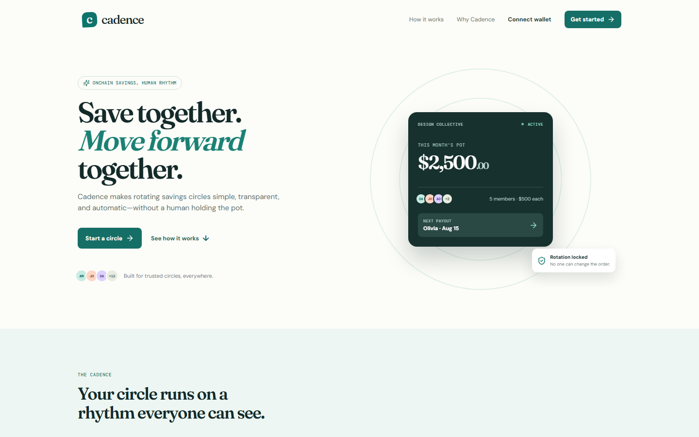
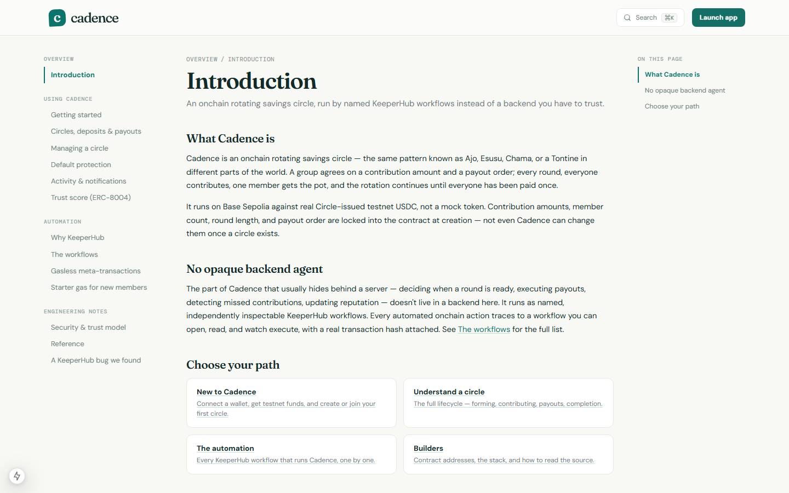
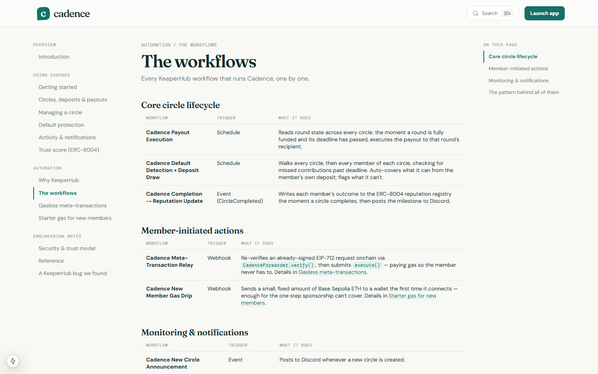

# Cadence

**A rotating savings circle (Ajo · Esusu · Chama · Tontine) that runs onchain, automated end-to-end by named, inspectable [KeeperHub](https://keeperhub.com) workflows — not a backend agent nobody can see inside.**

Built for the [KeeperHub — Agents Onchain Hackathon](https://dorahacks.io/hackathon/agents-onchain/detail) on DoraHacks.

[**Live app**](https://cadence-thrift.vercel.app) · [**Docs**](https://cadence-thrift.vercel.app/docs) · [**Proof-of-execution tx**](https://sepolia.basescan.org/tx/0x770ea56ecc368d2697af722fb601b39e2df1a7807e1bf9d17750e3e1f876f816) · [**KeeperHub bug we filed**](https://github.com/KeeperHub/keeperhub/issues/2049)


---

### Contents

- [The requirement, satisfied](#the-requirement-satisfied)
- [What Cadence is](#what-cadence-is)
- [Why KeeperHub, specifically](#why-keeperhub-specifically)
- [The nine workflows](#the-nine-workflows)
- [Reliability and observability](#reliability-and-observability)
- [We found and filed a real bug in KeeperHub itself](#we-found-and-filed-a-real-bug-in-keeperhub-itself)
- [Screenshots](#screenshots)
- [Architecture](#architecture)
- [Tech stack](#tech-stack)
- [Contract addresses](#contract-addresses)
- [Running locally](#running-locally)
- [Learn more](#learn-more)

---

## The requirement, satisfied

This hackathon has one rule: **every project must use KeeperHub as its onchain execution layer.** Cadence takes that further than a single integration point — there is no autonomous action anywhere in this app that isn't a named KeeperHub workflow. Nine of them, covering payouts, default protection, reputation, gas sponsorship, onboarding, and monitoring. Read state, decide, and act are always separate, inspectable steps — never a black-box script.

**Transaction proof** — the `Cadence New Member Gas Drip` workflow, live-tested end to end today:

| | Transaction | What it did |
|---|---|---|
| **First** | [`0xc571cc3f6619d0e7dd351343f7c74a3732a4cc0c0b8a1d07418bb8fba3f06f6d`](https://sepolia.basescan.org/tx/0xc571cc3f6619d0e7dd351343f7c74a3732a4cc0c0b8a1d07418bb8fba3f06f6d) | Sanity-check run — confirmed the webhook, wallet integration, and fixed-amount transfer were wired correctly. |
| **Latest** | [`0x770ea56ecc368d2697af722fb601b39e2df1a7807e1bf9d17750e3e1f876f816`](https://sepolia.basescan.org/tx/0x770ea56ecc368d2697af722fb601b39e2df1a7807e1bf9d17750e3e1f876f816) | The real case — 0.0005 Base Sepolia ETH sent unprompted to a brand-new, freshly generated wallet the instant it "connected," with zero balance beforehand. |

Payout execution, the meta-transaction relay, and the event-triggered reputation update have all been live-tested with real transactions against real circles on Base Sepolia too — see [`docs/DEPLOYMENT.md`](docs/DEPLOYMENT.md) for that run history and the bug write-up below.

---

## What Cadence is

Rotating savings circles are one of the oldest trust primitives in finance — a group agrees on a contribution amount and a payout order, and every round the pot rotates to the next member. It has always needed someone trusted to hold the money and enforce the rotation. Cadence removes that person: contribution amount, member count, round length, and payout order are locked into a smart contract at creation, and every automated decision from there — who gets paid, who missed a round, whose reputation updates — is executed by a KeeperHub workflow instead of a backend you have to trust.

It runs on Base Sepolia against **real Circle-issued testnet USDC**, not a placeholder token.

## Why KeeperHub, specifically

The hard part of an onchain agent was never the decision — it's the last mile: submitting the transaction reliably, with retries, sane gas handling, and a trail you can actually audit. That's exactly the gap KeeperHub fills, and Cadence leans on it for every single piece of automation instead of rolling a bespoke cron job or a hot-wallet script:

- **One managed wallet, every autonomous action.** Every workflow that moves funds or submits a transaction signs from the same KeeperHub-managed [Turnkey](https://turnkey.com)-backed wallet — `0x48Ee7A940c3b08A23D1d5c2BE9236d67f5b7Ba21` — watched by its own balance-monitor workflow so it never silently runs dry.
- **Reliability by construction.** `useSponsoredWrite` (the frontend's gasless-write path) falls back to a normal self-paid transaction if the relay is ever unavailable — a user is never stuck because KeeperHub had a bad moment. Every sponsored call is capped at a fixed gas limit and rate-limited per wallet.
- **A full audit trail.** Every workflow execution — trigger, node-by-node input/output, transaction hash, gas used — is inspectable in KeeperHub itself. Nothing in Cadence's automation is a mystery you have to trust; you can open the workflow and watch it run.
- **Built and operated through the KeeperHub MCP server.** Every workflow in this repo was created, validated (`validate_workflow`, deep bytecode check), executed, and debugged through KeeperHub's MCP tools during development — not clicked together once and forgotten.

## The nine workflows

| Workflow | Trigger | What it does |
|---|---|---|
| **Cadence Payout Execution** | Schedule (2 min) | Discovers every circle via the factory's event log; the moment a round is fully funded and past deadline, calls `executePayout()`. |
| **Cadence Default Detection + Deposit Draw** | Schedule (2 min) | Walks every circle → every member, checking for missed contributions past deadline; auto-covers what a deposit can absorb. |
| **Cadence Completion → Reputation Update** | Onchain event (`CircleCompleted`) | Writes each member's outcome to the ERC-8004 reputation registry the instant a circle completes — fully autonomous, no manual trigger. |
| **Cadence Meta-Transaction Relay** | Webhook | Re-verifies an EIP-712 signed request onchain, then submits it — the gas-sponsorship backbone for every member action. |
| **Cadence New Member Gas Drip** | Webhook | Sends a small, fixed amount of starter ETH to a wallet the first time it ever connects — the transaction linked above. |
| **Cadence New Circle Announcement** | Onchain event | Posts to Discord when a new circle is created. |
| **Cadence Stuck Circle Watchdog** | Schedule (daily) | Flags circles still Forming past a reasonable window. |
| **Cadence Contribution Reminders** | Schedule (30 min) | Posts upcoming contribution deadlines to Discord. |
| **Cadence Relayer Wallet Balance Monitor** | Schedule (6h) | Watches the shared KeeperHub wallet's ETH balance and alerts before it runs low. |

Full breakdown, including exact trigger config and the contracts each one calls, in the [in-app docs](https://cadence-thrift.vercel.app/docs/workflows).

## Reliability and observability

- **Gas-sponsored, with a real fallback.** Almost every member action (create, join, leave, contribute, cover/replenish a deposit, cancel, link an ERC-8004 identity) is gasless via an EIP-712 meta-transaction relayed through KeeperHub. If sponsorship isn't available, the app falls back to a self-paid transaction automatically — never a dead end.
- **Rate-limited and allow-listed.** The relay only ever forwards a fixed set of function selectors, capped gas, and a per-wallet daily limit enforced atomically against Postgres — arbitrary calldata is never trusted, even against a known-good target contract.
- **Idempotent, one-shot automation done safely.** The new-member gas drip reserves a wallet address atomically before doing anything, so it can be safely re-triggered on every connect without ever double-sending — and the transfer amount is a fixed literal inside the KeeperHub workflow itself, never taken from the calling request, so a bug in the API route could never turn it into an arbitrary-amount drain.
- **Every action traces to a name.** No cron job, no hidden script — if something in Cadence's automation misbehaves, there's exactly one named workflow to open and inspect.

## We found and filed a real bug in KeeperHub itself

While building `Cadence Default Detection + Deposit Draw`, a `Condition` node nested two `For Each` loops deep silently never executed — even against confirmed real defaults on live contracts. KeeperHub's workflow executor is open source, so we traced it: the nested-loop callback (`handleNestedForEach`) resolves a node's next step using the *inner* loop's own partial edge map instead of the workflow-global one, so a doubly-nested condition can never find its own outgoing edges.

Filed as [**KeeperHub/keeperhub#2049**](https://github.com/KeeperHub/keeperhub/issues/2049) — open, with three reproduction execution IDs and a suggested one-line fix pointing at the exact line. The workflow is correctly configured against Cadence's live contracts and will start working the moment the fix ships. In the meantime, defaults aren't unrecoverable — the contract lets any member, not just the automated keeper, cover one manually.

Full root-cause writeup: [`docs/DEPLOYMENT.md`](docs/DEPLOYMENT.md) and the [in-app docs](https://cadence-thrift.vercel.app/docs/keeperhub-bug).

## Screenshots

<table>
<tr><td colspan="2" align="center"><br /><i>Landing page</i></td></tr>
<tr>
<td width="50%"><br /><i>Docs — introduction</i></td>
<td width="50%"><br /><i>Docs — every KeeperHub workflow, named and explained</i></td>
</tr>
</table>

## Architecture

```
Member's wallet
   │  signs EIP-712 ForwardRequest (no gas)
   ▼
Next.js app (Vercel)  ──POST /api/relay──▶  KeeperHub webhook
   │                                            │  verify() + execute()
   │                                            ▼
   │                                    CadenceForwarder (ERC-2771)
   │                                            │
   ▼                                            ▼
Onchain reads (wagmi/viem)          AjoCircle / CircleFactory / TrustScoreRegistry
                                             ▲
                     ┌───────────────────────┼───────────────────────┐
                     │                       │                       │
        Schedule-triggered workflows   Event-triggered workflow   Webhook-triggered workflows
        (payouts, default detection)   (reputation on completion)  (relay, gas drip)
                     └───────────────────────┴───────────────────────┘
                                    KeeperHub (Turnkey-backed wallet)
```

## Tech stack

- **Contracts** — Solidity 0.8.24, Hardhat, OpenZeppelin (`ERC2771Context`, `ReentrancyGuard`)
- **Frontend** — Next.js 15 (App Router), wagmi v2, viem, RainbowKit, TypeScript
- **Automation** — KeeperHub (MCP server + workflow builder), Turnkey-backed managed wallet
- **Data** — Neon Postgres (off-chain preferences and relay rate-limiting; nothing financial lives here)
- **Identity & reputation** — ERC-8004 identity and reputation registries

## Contract addresses

Base Sepolia, chain ID `84532`.

| Contract | Address |
|---|---|
| CircleFactory | [`0x15503495838757C8753F866AfB0dD61D0E3770B7`](https://sepolia.basescan.org/address/0x15503495838757C8753F866AfB0dD61D0E3770B7) |
| TrustScoreRegistry | [`0x2C272F27D278FD09b6Eabe574D5fDA5dE84B8Edf`](https://sepolia.basescan.org/address/0x2C272F27D278FD09b6Eabe574D5fDA5dE84B8Edf) |
| CadenceForwarder (ERC-2771) | [`0xD73Eda898c3DbF6996d409fB2442Dd38f719e608`](https://sepolia.basescan.org/address/0xD73Eda898c3DbF6996d409fB2442Dd38f719e608) |
| KeeperAuthorization | [`0x37D7fe84C4154Ec4A59d0750a654e97d787A572d`](https://sepolia.basescan.org/address/0x37D7fe84C4154Ec4A59d0750a654e97d787A572d) |
| USDC (Circle, testnet) | [`0x036CbD53842c5426634e7929541eC2318f3dCF7e`](https://sepolia.basescan.org/address/0x036CbD53842c5426634e7929541eC2318f3dCF7e) |
| KeeperHub-managed wallet | [`0x48Ee7A940c3b08A23D1d5c2BE9236d67f5b7Ba21`](https://sepolia.basescan.org/address/0x48Ee7A940c3b08A23D1d5c2BE9236d67f5b7Ba21) |

## Running locally

```bash
npm install
cp .env.example .env   # fill in RPC URL, contract addresses, KeeperHub keys, Neon connection string
npm run dev
```

Contracts:

```bash
npm run contracts:compile
npm run contracts:test
npm run contracts:deploy:base-sepolia
```

Full deployment history, redeploy notes, and the KeeperHub workflow setup: [`docs/DEPLOYMENT.md`](docs/DEPLOYMENT.md).

## Learn more

The in-app docs at [`/docs`](https://cadence-thrift.vercel.app/docs) cover the whole product — getting started, how a circle actually runs, every workflow in detail, the gasless meta-transaction relay, the security model, and the engineering notes above — not just this hackathon submission.
